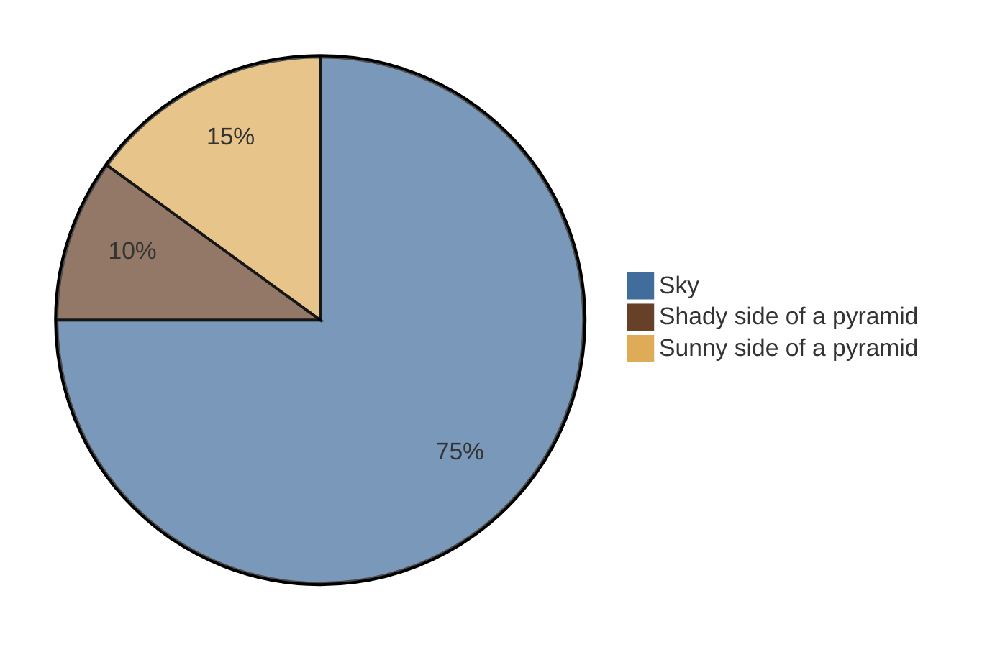

# RITAL - Projet
## Template
Chaque dossier (*projet*) se base sur ce template, qui est [basé de ce site](https://neptune.ai/blog/how-to-structure-and-manage-nlp-projects-templates). 
```
├── README.md          <- The top-level README for developers using this project.
├── data
│   ├── interim        <- Intermediate data that has been transformed.
│   ├── processed      <- The final, canonical data sets for modeling.
│   └── raw            <- The original, immutable data dump.
│
├── models             <- Trained and serialized models, model predictions, or model summaries
│
├── notebooks          <- Jupyter notebooks. Naming convention is a number (for ordering),
│                         the creator's initials, and a short `-` delimited description, e.g.
│                         `1.0-jqp-initial-data-exploration`.
│
├── reports            <- Generated analysis as HTML, PDF, LaTeX, etc.
│   └── figures        <- Generated graphics and figures to be used in reporting
│
├── requirements.txt   <- The requirements file for reproducing the analysis environment, e.g.
│                         generated with `pip freeze > requirements.txt`
│
├── src                <- Source code for use in this project.
│   ├── __init__.py    <- Makes src a Python module
│   │
│   ├── data           <- Scripts to download or generate data
│   │   └── make_dataset.py
│   │
│   ├── features       <- Scripts to turn raw data into features for modeling
│   │   └── build_features.py
│   │
│   ├── models         <- Scripts to train models and then use trained models to make
│   │   │                 predictions
│   │   ├── predict_model.py
│   │   └── train_model.py
│   │
│   └── visualization  <- Scripts to create exploratory and results oriented visualizations
│       └── visualize.py
```
_________
## Notes 
- [Odds ratio (OR)](https://en.wikipedia.org/wiki/Odds_ratio) method may improve word cloud
- Rapport :
    - Impact du *cleaning*
    - Variante de BoW
    - Comment les traitements varient en fonction des deux tâches ?
- PoS *facultatif* (questions à se poser : quel intérêt ? comment l'intégrer ? (ex : *comme une feature classique ?*) => Ouii mais vaut mieux rester sur du BoW simple (source : prof))
- Trouver **le** meilleur modèle de BoW

_________
## Todo
- [ ] Faire de la cross-validation
- [ ] Dataviz (pour que ça CLAQUE)
    - [ ] Odd Ratio
    - [ ] Sur les poids https://amueller.github.io/aml/05-advanced-topics/13-text-data.html#classification
    - [ ] Zipfs law
- [X] Faire une fonction pour écrire les résultats des expériences quelque part (classiquement le classif report)
- [X] Implémenter filtre des nombres dans `data.py/Custom_analyzer()`
- [X] Implémenter filtre de la ponctuation dans `data.py/Custom_analyzer()`
- [X] Transférer le framework de test pour Chirac/Mitterand
- [X] `GridSearch` / `Pipeline`?
- [ ] Model sequentiel (trouver les bloc into classifier) : on peut pas utiliser les HHM car on doit input 
    - Soit LSTM
    - Soit à partir des prédiction de base -> débruitage -> classifier en bloc
- [X] Postprocess "bruit"
- [X] Exp sur les postprocess
- [ ] Gridsearch sur le model BERT là avec les embeding vectoriel
- [ ] Réduction de dimension
- [ ] Gridsearch préprocessing
- [X] N-sentence
- [ ] 


